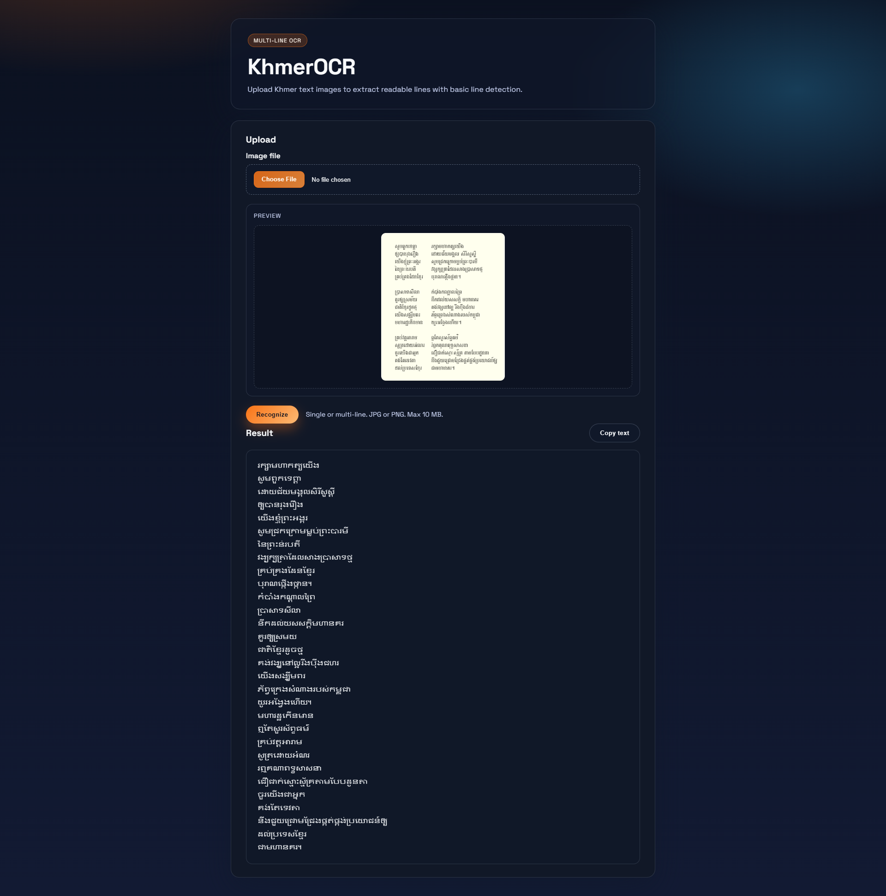

# Laravel Khmer OCR

A Laravel app that wraps KhmerOCR for Khmer text recognition with a clean UI and basic multi-line detection. Upload an image, preview it, and copy the extracted text.

## Screenshot



## Requirements

- PHP 8.2+
- Composer
- Node.js 18+ and npm
- Python 3.10+ with pip
- KhmerOCR files available locally (default: `_refs/KhmerOCR` with `recognize.py` and `model.pt`)

## Setup

1) Install PHP dependencies:

```bash
composer install
```

2) Install frontend tooling:

```bash
npm install
```

3) Configure environment:

```bash
copy .env.example .env
php artisan key:generate
```

4) Set OCR environment variables in `.env`:

```ini
KHMER_OCR_REPO_PATH=C:\wamp64\www\laravel-ocr\_refs\KhmerOCR
KHMER_OCR_PYTHON=C:\wamp64\www\laravel-ocr\.venv\Scripts\python.exe
KHMER_OCR_TIMEOUT=60
```

5) Create a Python venv and install OCR dependencies:

```bash
python -m venv .venv
.venv\Scripts\python -m pip install -U pip
.venv\Scripts\pip install numpy pillow torch opencv-python
```

6) Ensure storage is web-accessible:

```bash
php artisan storage:link
```

## Run Locally

```bash
php artisan serve
```

Open `http://127.0.0.1:8000/` and upload an image.

## OCR Notes

- Multi-line detection uses OpenCV heuristics and then runs KhmerOCR on each line.
- For best results, use high-contrast scans and keep text lines horizontal.
- If you move KhmerOCR elsewhere, update `KHMER_OCR_REPO_PATH`.

## Troubleshooting

- If Python fails to start, verify `KHMER_OCR_PYTHON` points to a real `python.exe` and that `python -c "import os; print(os.urandom(16))"` works for your user.
- If images do not show in the result, re-run `php artisan storage:link`.
